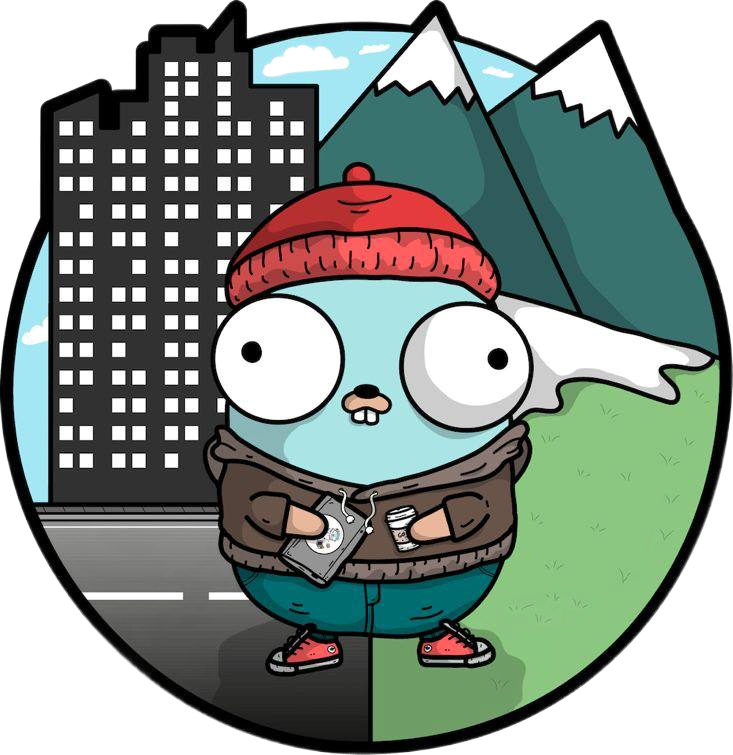
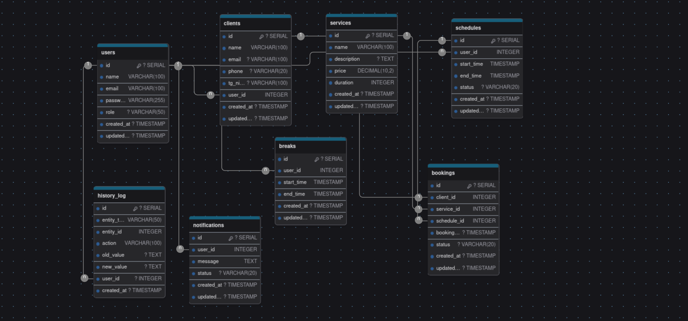

# ✂️ GoBarberCRM API

---

<p align="center">
  
</p>

---

<p align="center">
  
  
  
  
  
</p>

<p align="center">
  <a href="https://github.com/0sokrat0/GoBarberCRM-API">
    
  </a>
  <a href="https://t.me/SOKRAT_00">
    
  </a>
</p>

GoBarberCRM API — это высокопроизводительный backend API для управления системой CRM в барбершопах. Он предоставляет удобные инструменты для работы с клиентами, расписанием, бронированием услуг и уведомлениями.

---

## 📖 Основные возможности

- 📅 Управление расписанием сотрудников.
- 💈 Учет клиентов и их истории посещений.
- 🛠 Управление услугами и их ценами.
- 📲 Отправка уведомлений (Telegram/SMS/Email).
- 📊 Аналитика и отчеты.
- 🔒 Безопасная аутентификация через JWT.

---

## 🚀 Технологии

| Технология      | Описание                                    |
|------------------|---------------------------------------------|
| **Go**          | Основной язык для разработки backend API    |
| **Gin**         | Легкий и быстрый фреймворк для REST API     |
| **PostgreSQL**  | Реляционная база данных                     |
| **GORM**        | ORM для работы с базой данных PostgreSQL    |
| **Docker**      | Контейнеризация приложения                  |
| **Swagger**     | Автодокументация API                        |

---

## 📂 Структура проекта

```plaintext
.
├── app
│   ├── cmd
│   │   └── main.go
│   ├── configs
│   │   ├── configs.go
│   │   └── config.yaml
│   ├── docs
│   │   ├── docs.go
│   │   ├── swagger.json
│   │   └── swagger.yaml
│   ├── internal
│   │   ├── app
│   │   │   └── routes.go
│   │   ├── auth
│   │   │   ├── hashpass.go
│   │   │   └── jwt.go
│   │   ├── handlers
│   │   │   ├── auth.go
│   │   │   ├── bookings.go
│   │   │   ├── breaks.go
│   │   │   ├── clients.go
│   │   │   ├── notifications.go
│   │   │   ├── schedules.go
│   │   │   ├── services.go
│   │   │   └── users.go
│   │   ├── middleware
│   │   │   ├── CORSM.go
│   │   │   ├── jwt.go
│   │   │   └── RequestLogger.go
│   │   ├── models
│   │   │   ├── AuthUser.go
│   │   │   ├── bookings.go
│   │   │   ├── breaks.go
│   │   │   ├── clients.go
│   │   │   ├── notifications.go
│   │   │   ├── schedules.go
│   │   │   ├── services.go
│   │   │   └── users.go
│   │   ├── repositories
│   │   │   ├── auth.go
│   │   │   ├── bookings.go
│   │   │   ├── breaks.go
│   │   │   ├── clients.go
│   │   │   ├── notifications.go
│   │   │   ├── schedules.go
│   │   │   ├── services.go
│   │   │   └── users.go
│   │   ├── routes
│   │   │   ├── auth.go
│   │   │   ├── booking.go
│   │   │   ├── breaks.go
│   │   │   ├── clients.go
│   │   │   ├── notifications.go
│   │   │   ├── schedules.go
│   │   │   ├── services.go
│   │   │   └── users.go
│   │   └── services
│   │       ├── bookings.go
│   │       ├── breaks.go
│   │       ├── clients.go
│   │       ├── notifications.go
│   │       ├── schedules.go
│   │       ├── services.go
│   │       └── users.go
│   ├── pkg
│   │   ├── db
│   │   │   └── connection.go
│   │   ├── logger
│   │   │   └── logger.go
│   │   └── utils
│   │       ├── apiresponse.go
│   │       └── img
│   │           ├── APiGO.png
│   │           └── gopher.png
│   └── tests
│       └── repositories
│           └── tests
│               ├── client_repository_test.go
│               ├── helptest.go
│               ├── notification_repository_test.go
│               ├── schedule_repository_test.go
│               ├── service_repository_test.go
│               └── user_repository_test.go
├── docker-compose.yml
├── Dockerfile
├── go.mod
├── go.sum
└── README.md

```

---

## 🗂 Структура БД

<p align="center">
  
</p>

---

## 📋 Документация API

API задокументирован и доступен по адресу: [http://localhost:8080/swagger/index.html](http://localhost:8080/swagger/index.html).

---

## 🛠 Установка и запуск

### 1. Установка зависимостей

Убедитесь, что у вас установлен **Go**, **Docker** и **PostgreSQL**:

```bash
go mod tidy
```

### 2. Настройка окружения

Создайте файл `config.yaml` в папке `app/configs/` со следующим содержимым:

```yaml
database:
  user: postgres
  password: password
  host: localhost
  port: 5432
  name: gobarbercrm

jwt:
  secret: "your_secret_key"
```

### 3. Запуск проекта

#### Локальный запуск

```bash
go run cmd/main.go
```

#### Через Docker

```bash
docker build -t gobarbercrm .
docker run -p 8080:8080 gobarbercrm
```

---

## 📂 Основные эндпоинты

| Метод   | Эндпоинт                 | Описание                                  |
|---------|--------------------------|-------------------------------------------|
| `GET`   | `/clients`              | Получить список клиентов                  |
| `POST`  | `/clients`              | Добавить нового клиента                   |
| `GET`   | `/services`             | Получить список услуг                     |
| `POST`  | `/bookings`             | Забронировать услугу                      |
| `GET`   | `/schedules`            | Получить расписание сотрудников           |

---

## 🤝 Вклад в проект

### Как внести изменения

1. Форкните репозиторий.
2. Создайте новую ветку:

   ```bash
   git checkout -b feature/YourFeature
   ```

3. Сделайте свои изменения и зафиксируйте их:

   ```bash
   git commit -m "Добавлен функционал: YourFeature"
   ```

4. Отправьте изменения на свой форк:

   ```bash
   git push origin feature/YourFeature
   ```


5. Откройте **Pull Request** и добавьте описание изменений.

---
